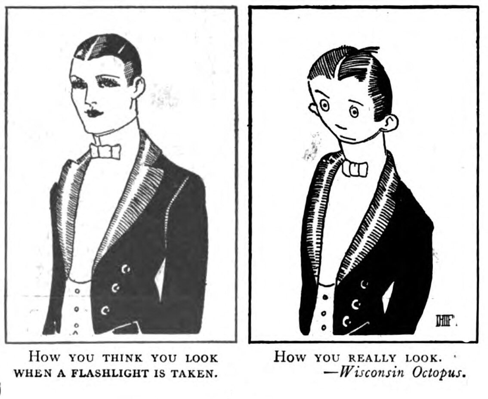
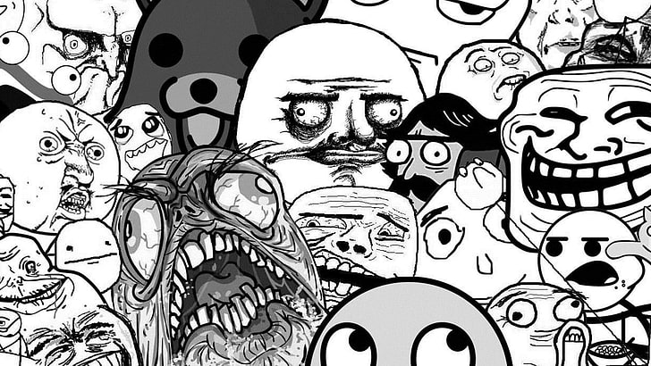

Il termine venne coniato da Richard Dawkins nel 1976 e fece la sua prima comparsa nel libro “Il gene egoista”, come tentativo di spiegare il modo in cui le informazioni culturali si diffondessero. Il meme viene definito come un’ informazione che risiede nel cervello di un individuo e che si propaga attraverso la comunicazione, e si basa dunque su un meccanismo a cavallo tra l’imitazione e la mutazione. Il meme funziona quindi esattamente come il gene, la cui caratteristica fondamentale è quella di replicarsi in organismi diversi, generando inevitabilmente una mutazione. Dawkins ha coniato il termine “meme” partendo dalla radice greca mimeme, che significa “imitazione”, e ha volutamente accorciato la parola in “meme” per assonanza con la parola “gene”, evidenziando fin da subito le loro somiglianze. Potremmo definire i meme come l’unità base dell’evoluzione.

La prima apparizione di un meme risale al 1919, in una striscia comica della rivista satirica dell’Università dell’Iowa Wisconsin "Octopus". Nella striscia c'è un illustrazione con sotto la descrizione che recita: "Come pensi di essere uscito nella foto con il flash, come sei venuto davvero". 

Si tratta di una rielaborazione di un qualsiasi contenuto come scene di film, serie o programmi TV, video, opere artistiche che mira a suscitare il divertimento dell’osservatore, permettendogli di immedesimarsi nell’immagine attraverso una breve contestualizzazione che si ricollega al suo vissuto personale e quotidiano. La condivisione di un’esperienza, elemento cardine del meme, consente di parlare di un’altra caratteristica fondamentale dei meme: la viralità. I meme, presentando delle esperienze comuni, stimolano la condivisione e generano un fenomeno virale. 

Nel corso degli anni, i meme sono approdati su internet, più precisamente su blog e forum. La prima culla dei meme è stato infatti il forum 4chan, costituito da una bacheca in cui ogni utente poteva prendere parte a un ramo della discussione (detto thread, ndr) che ruotava su un argomento specifico del tema madre. Alcuni utenti del forum, con l’obiettivo di creare un senso di condivisione, hanno iniziato a cristallizzare episodi e concetti chiave del forum in vignette che ne riassumevano il senso. 
Queste vignette, con l’avvento dei social, si sono trasformate nei famosissimi e primi veri meme riconosciuti: quelli della categoria “rage comics”, ovvero dei disegni stilizzati e minimali dalle sembianze umane, talvolta accompagnati da una parola e di carattere satirico.

Poco dopo sostituiti da quella dei “top text/bottom text”, questi meme presentano due testi (uno sopra e uno sotto) e un’immagine centrale, che si poteva modificare. 

Nonostante queste categorizzazioni, oggi le caratteristiche grafiche dei meme possono assumere aspetti molto diversi, perciò non esistono delle classificazioni rigide all’interno delle quali collocarli.

