
Raccolta dei meme iconici che hanno segnato la storia, *universalmente riconosciuti*


---
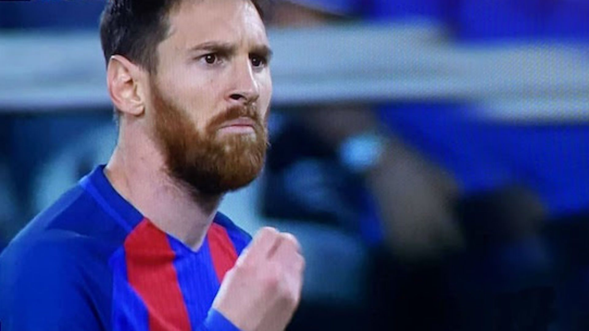
L’iconico gesto ‘all’italiana’ di Messi, è rimasto nella mente di chi lo ha visto in diretta. Succede a Torino durante i quarti di finale della Champions League 16/17, Messi riceve un cross da sinistra, si coordina per tirare in porta e l'arbitro fischia, fermando l'azione. 
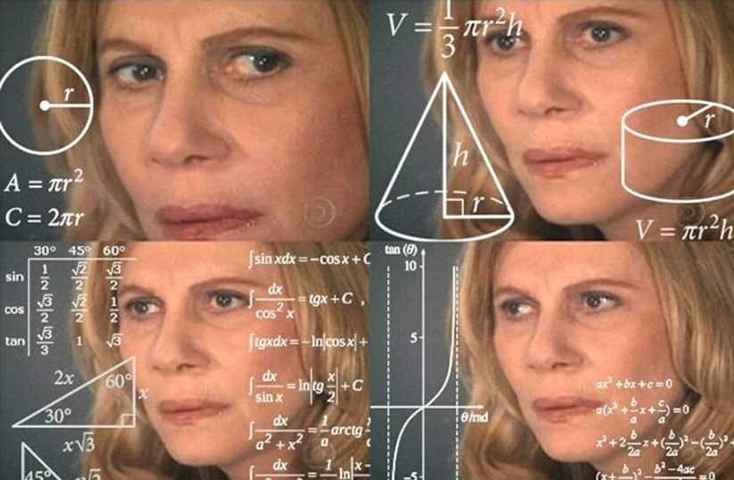
Il volto immortalato è quello di Renata Sorrah, un’attrice brasiliana nota per aver interpretato la perfida Nazaré Tedesco nella telenovela del 2004 "Senhora do Destino". I quattro frame sono presi da una puntata della telenovela in cui l’attrice si dimostra preoccupata usando la tipica intensità espressiva da soap latino-americana. 
Al suo sguardo assorto sono stati aggiunti dei simboli matematici che ne hanno decretato il successo come meme. Math Lady è l'esempio di quando sei alla cassa con 20 euro e paghi 12, la cassiera ti dice se hai 2 euro così ti torna 10 interi.
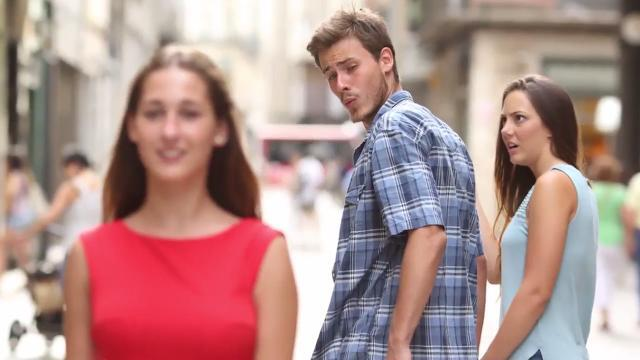
"Distracted Boyfriend" è un meme basato su una fotografia stock del fotografo spagnolo Antonio Guillem. Gli utenti dei social media hanno iniziato a usare l'immagine come meme all'inizio del 2017, diventando virale nell'agosto 2017 per rappresentare diverse forme di infedeltà.

Espressione di felicità forzata, con gli occhi disperati e il sorriso stampato, sembra essere perfetta per descrivere ogni situazione in cui fingiamo che vada tutto bene.

Woman Yelling at a Cat è nato dall’unione di due meme già esistenti. La foto del gatto a tavola e Tyler Armstrong, una delle partecipanti della trasmissione "Real Housewibes of Beverly Hills" che nel corso di un episodio è stata ritratta piangendo nel bel mezzo di una discussione. 

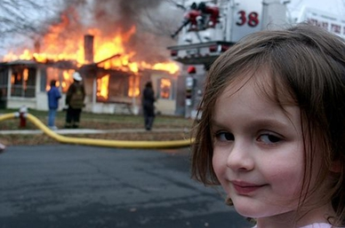
Nato da una foto scattata nel 2005 alla piccola Zoë Roth, 4 anni all’epoca, questa immagine ritrae una bimba sorridente mentre, sullo sfondo, una casa va in fiamme con una squadra di pompieri al lavoro. A immortalare la scena è stato il padre di Zoë, David Roth, fotografo amatoriale. 

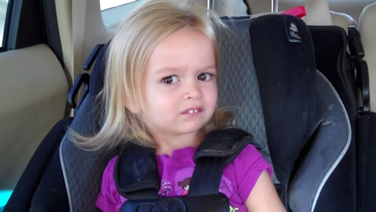
Questo l’ottavo meme più famoso di sempre. L’immagine è presa da un video del 2013. Chloe e la sorella sono in macchina e la mamma le riprende mentre rivela loro che le sta portando a Disney Land invece che a scuola.

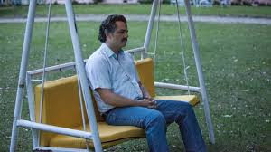
Pablo, grazie al web, diventa il "forever alone", o l’amico arrivato in anticipo che ci aspetta quando siamo in ritardo, travolto dal vuoto cosmico dell’esistenza e in attesa di qualcosa che sembra non arrivare mai.

Questo meme inizia a circolare dal 2010, ma è nel 2013 che esplode soprattutto su Facebook e Twitter vincendo anche il titolo di "Miglior meme dell'anno". Kabosu il cane è diventato così popolare perchè utilizzato per tantissimi scopi satirici. 

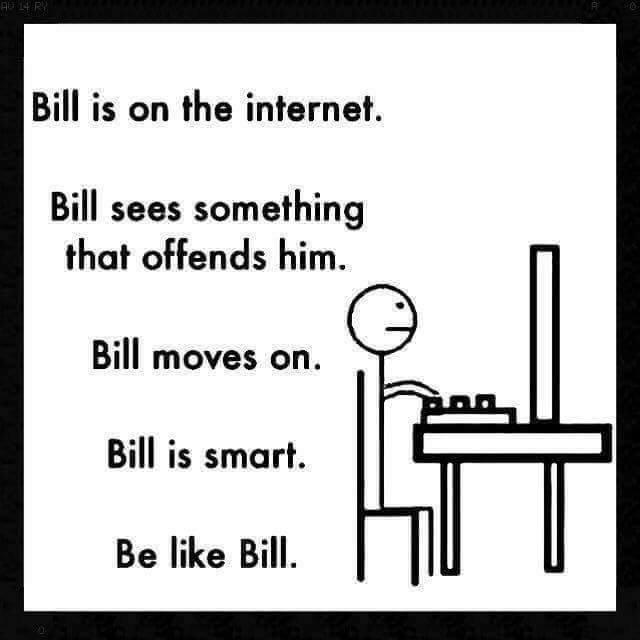
Descritto come il protagonista di una webcomic Be like Bill è un omino stilizzato, accompagnato da scritte con le quali si tenta di insegnare una netiquette ossia un comportamento intelligente e rispettoso da seguire.

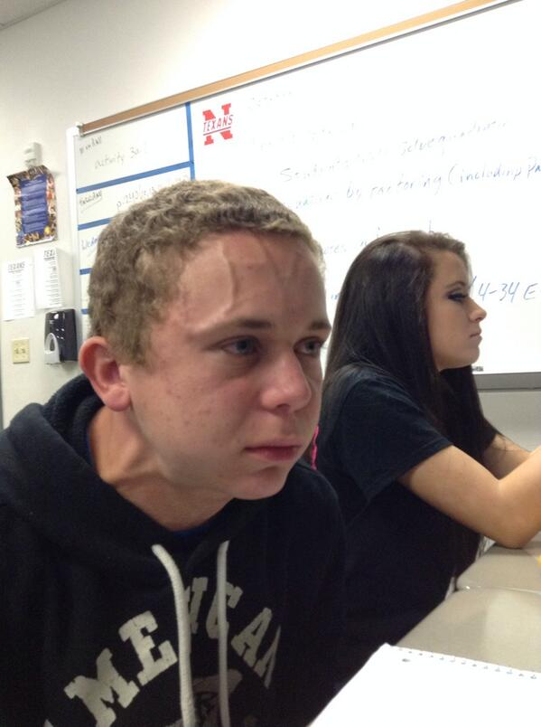
Una foto bizzarra, a tratti banale che è diventata super virale. Nato con la connotazione grastro-intestinale è però diventato un simbolo per chiunque stia compiendo una fatica incredibile a tratterenersi dal dire o fare qualcosa. Nonostante sembri una foto spontanea, secondo quanto riportato dallo stesso protagonista la posa era voluta per la pubblicazione di una foto divertente su twitter.  

"Ragazzo Stonks" è il meme azionario risalente al 2017 che prende in giro ironicamente chi pensa di saperla lunga in campo economico. Il meme presentandosi su uno sfondo che rappresenta le azioni in borsa riporta la scritta Stonks, che è la volontaria storpiatura della parola Stocks, ossia azioni in borsa. Il protagonista del meme si chiama Meme men, nato nel 2014 come la mascotte della pagina Facebook *Special Meme Fresh*.

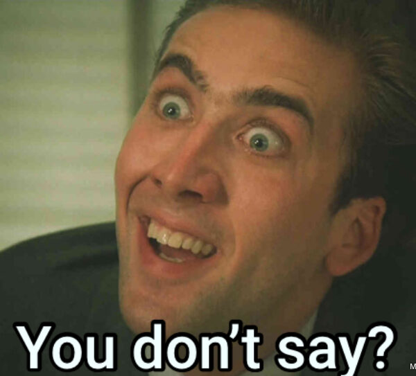
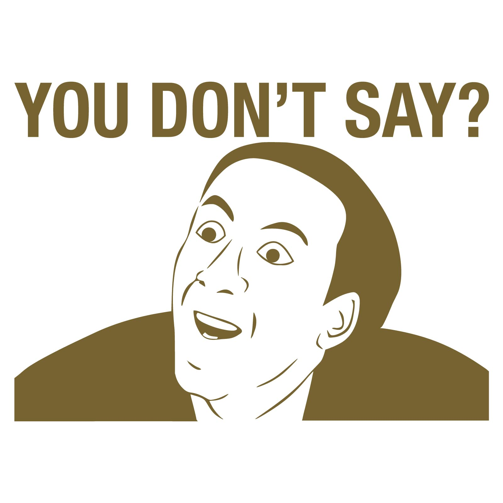
Il meme "You don't say" è diventato famoso grazie al volto di Nicholas Cage, esso è accompagnato al lato da una stilizzazione del volto dello stesso. Nasce per commentare sarcasticamente qualcuno che ha appena detto un'ovvietà. 

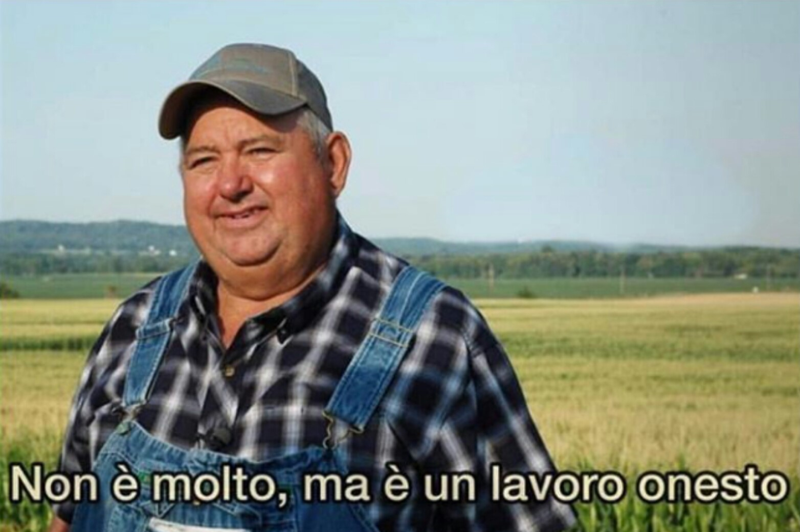
Diverso tempo fa è diventato un meme trementamente virale, l'immagine tratta da una campagna avvenuta negli Stati Uniti per la sensibilizzazione sul tema della salute del suolo. Il soggetto protagonista è un fattore che guarda l'orizzonte, mentre in basso è riportata la scritta "It ain't much, but it's honest work" aka "Non è molto, ma è un lavoro onesto". 

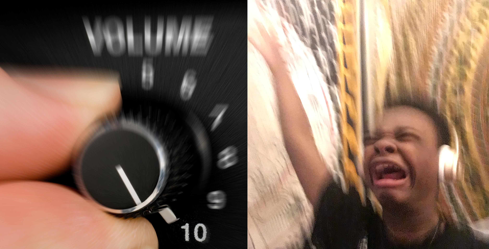
La sua prima comparsa sul web risale a maggio 2016, ed è opera di Jay Versace.

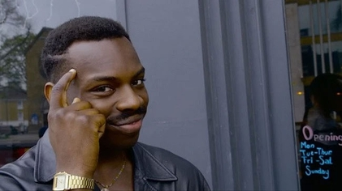
Il meme del ragazzo che si punta il dito sulla tempia è sempre accompagnato da una frase sarcastica che inizia con "non puoi"; Es. Non puoi essere al verde, se non controlli il tuo conto bancario.
L'immagine viene dalla web series Hood Documentary. L'attore si chiama Kayode Ewumi e il personaggio è Kayode Ewumi.
