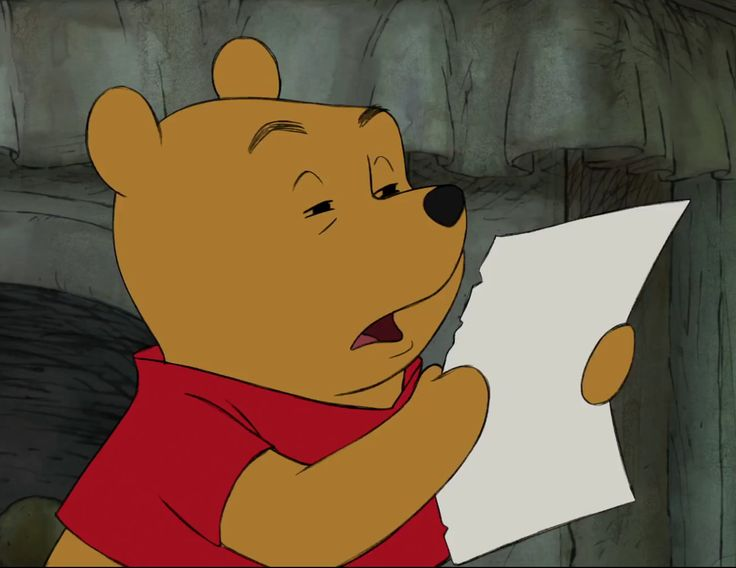

Signori boomer, benvenuti. 
Se vi trovate qui è perchè sono quasi del tutto certa che ci sia la volontà da parte vostra di imparare tutto ciò che c'è da sapere su questo mondo così rigettato da voi; quello dei meme. 
Prima di tutto vorrei chiarire un piccolissimo dettaglio che potenzialmente potrebbe avervi già fuorviato; cos'è un boomer? 

Boomer è un appellativo ironico attribuito a persona che mostri atteggiamenti o modi di pensare ritenuti ormai superati dalle nuove generazioni, per estensione a partire dal significato proprio che indica una persona nata negli anni del cosiddetto “baby boom”, e cioè nel periodo di forte incremento demografico al termine del secondo conflitto mondiale, tra il 1946 e il 1964. In pratica quelli che oggi su Facebook si dilettano a condividere Buongiornissimi Kaffè e notizione non esattamente verosmili, tipo il concorsone che rifili al nipote disoccupato che ti promette un posto di lavoro a tempo indeterminato e i milioni. (Giusto per capirci).
 
 
Tra l'altro da questo gap generazionale è nato il meme "OK boomer", in un senso a metà tra il sarcastico e l’offesa, usata da adolescenti e giovani per zittire o prendere in giro cose percepite come lamentele paternalistiche della generazione dei cinquanta-sessanta-settantenni ritenuta con una generalizzazione  responsabile dei principali disastri contemporanei, dalla crisi finanziaria a quella climatica. 

Dopo aver compreso ciò passiamo al punto focale della questione: *Come si legge un meme?*  

"Leggere" un meme non è difficile, nonostante a volte richiedano una certa conoscenza del linguaggio online e delle tendenze culturali. Per comprenderli è importante considerare alcuni fattori principali: 

**L'immagine**: Un meme è spesso una foto, un disegno o un video. L'immagine stessa può avere un significato simbolico, evocare un'emozione o essere associata a un evento specifico.
**Il testo**: Alle immagini potrebbero aggiungersi frasi o citazioni, aggiungono contesto, significato e umorismo. Il testo può essere in italiano o in altre lingue.
**Il contesto culturale**:  I meme spesso si riferiscono a situazioni, eventi o personaggi famosi. Per capirli bene, è utile conoscere il contesto culturale e le dinamiche online. 
Altri fattori da considerare sono **l'ironia** e **l'umorismo**, questo perchè essendo progettati per divertire è fondamentale tenere in considerazione il tono con cui si leggono. 
In sostanza, leggere un meme è come leggere un'immagine con un sottotitolo, cercando di decifrare il messaggio e il significato che vuole essere trasmesso attraverso l'umorismo e l'ironia.

